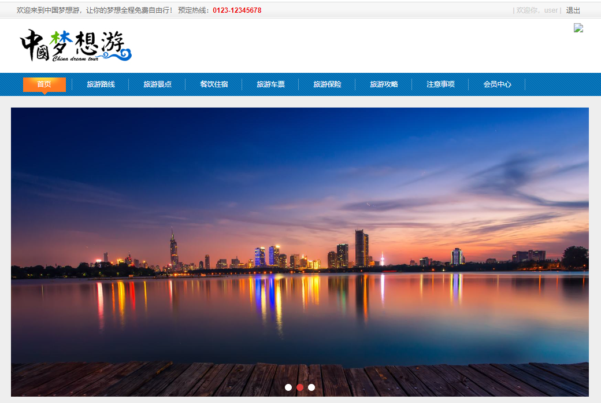
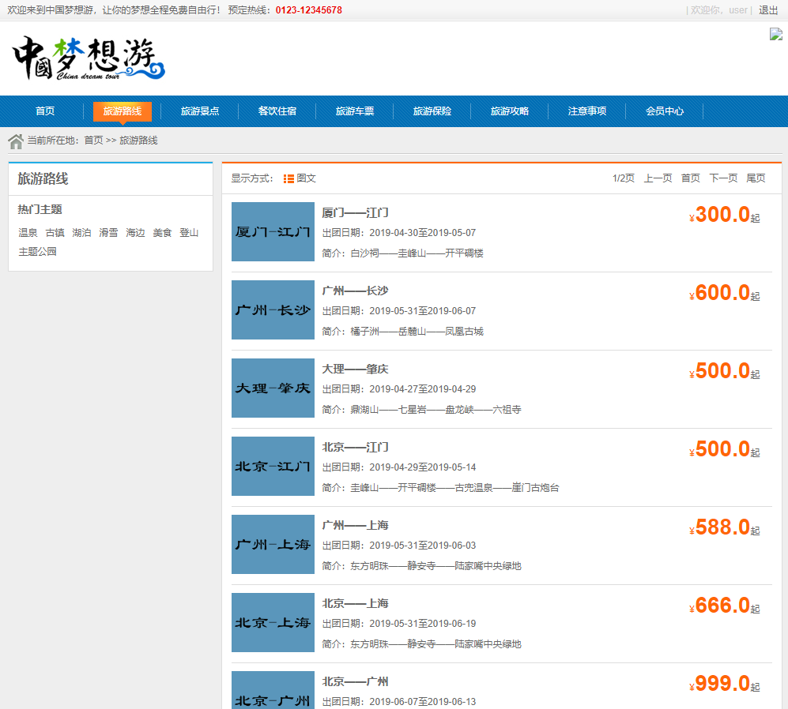
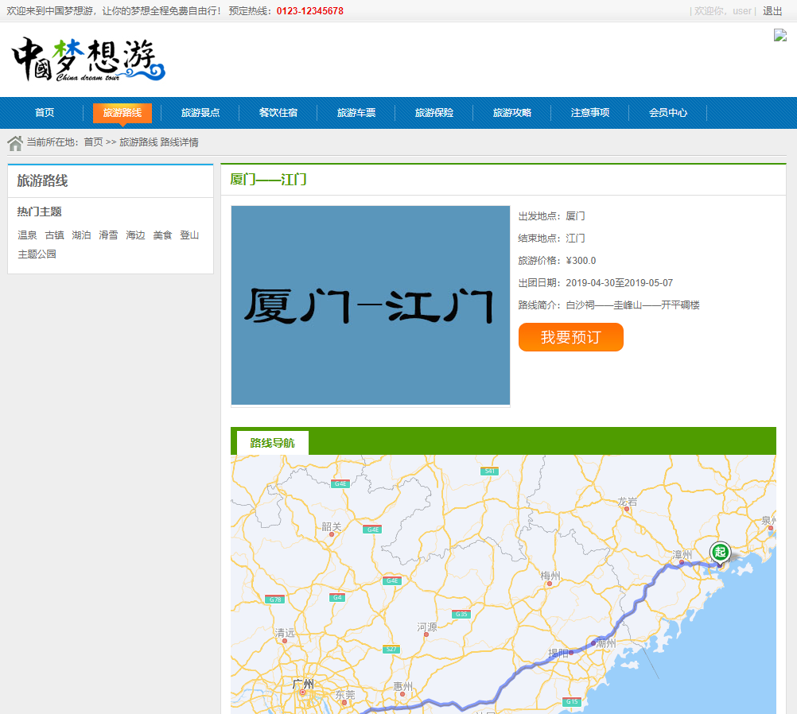
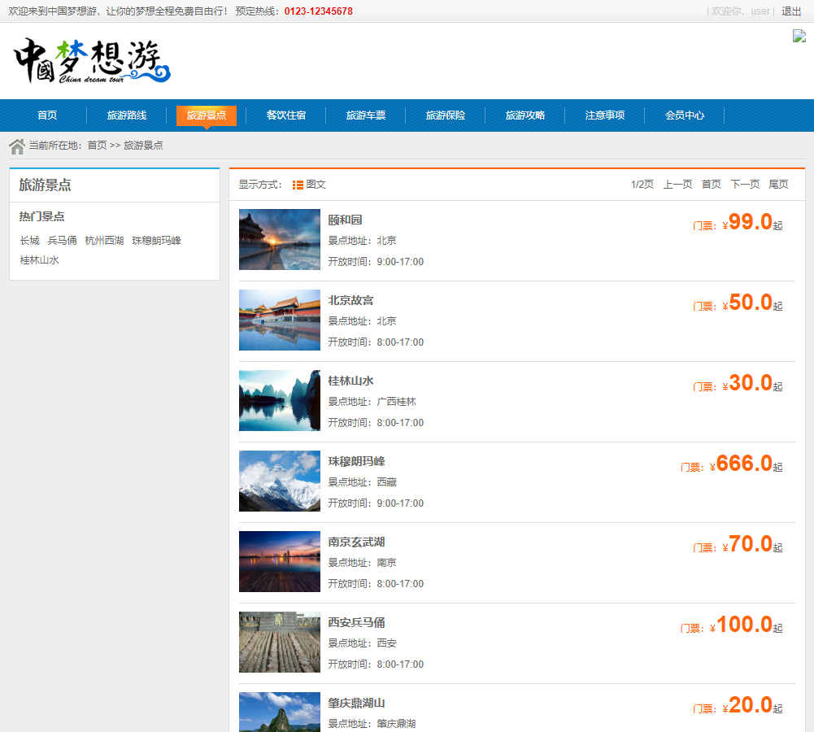
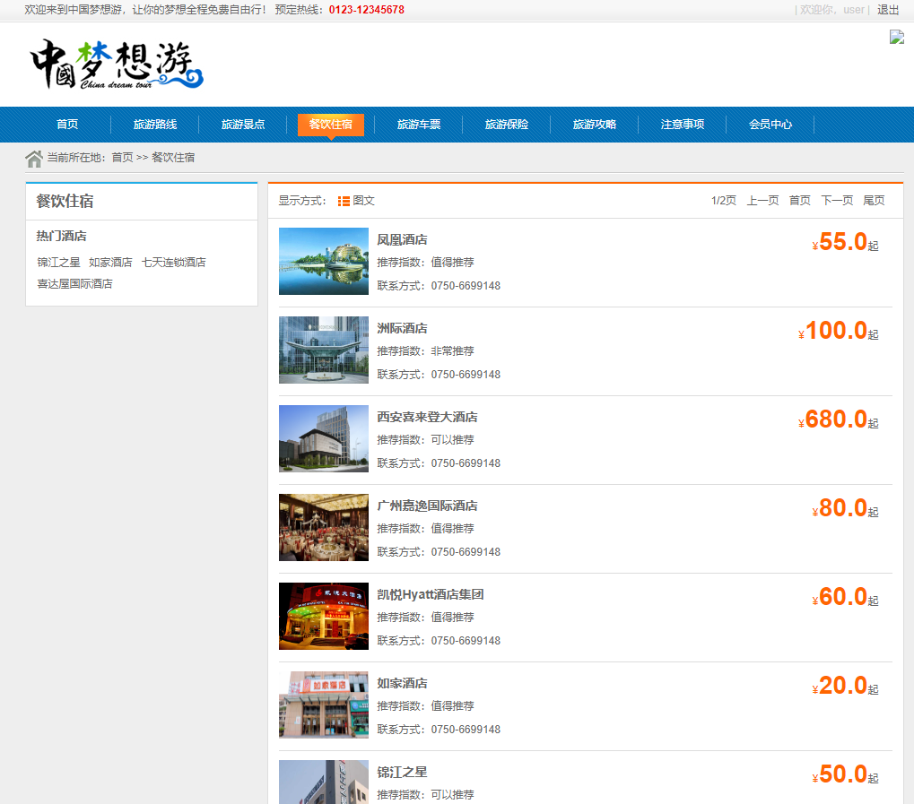
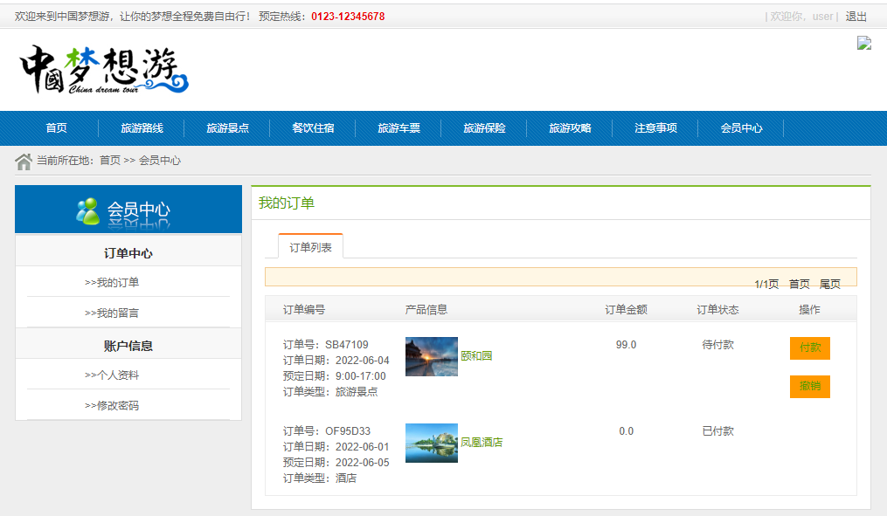
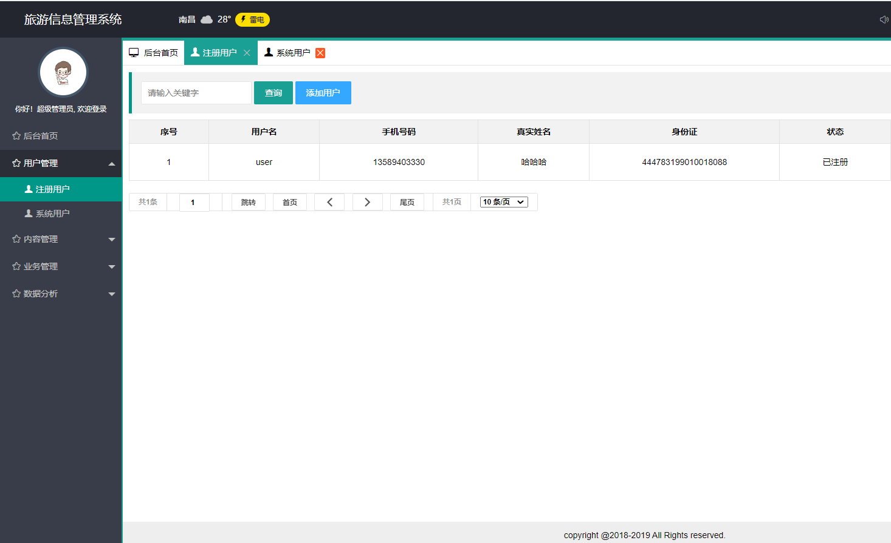
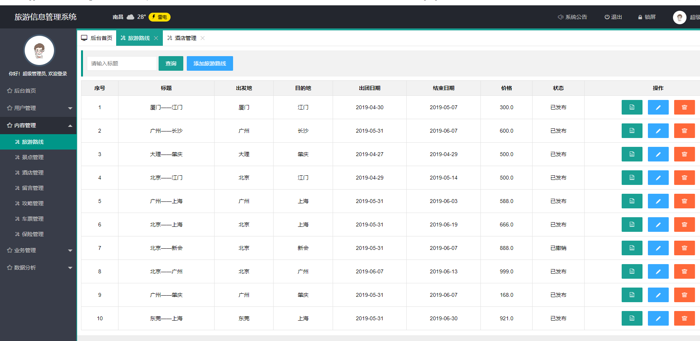
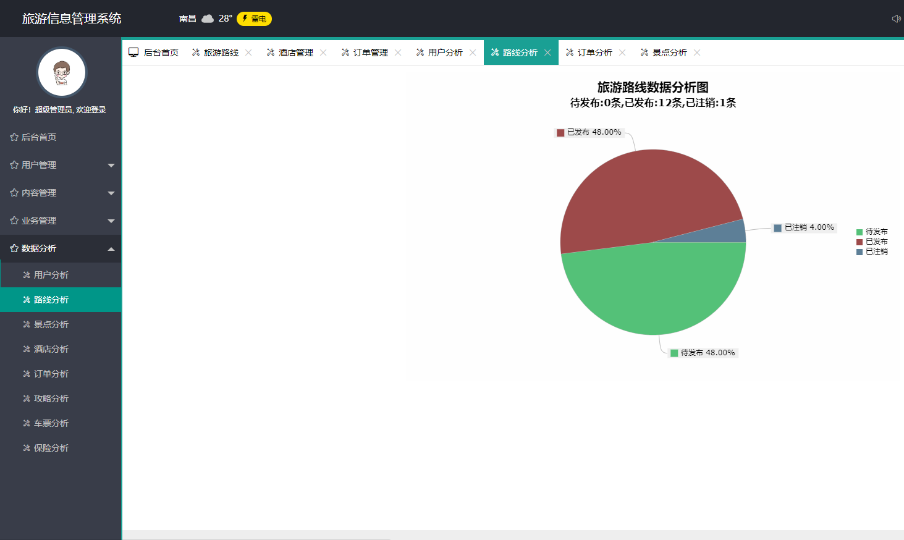
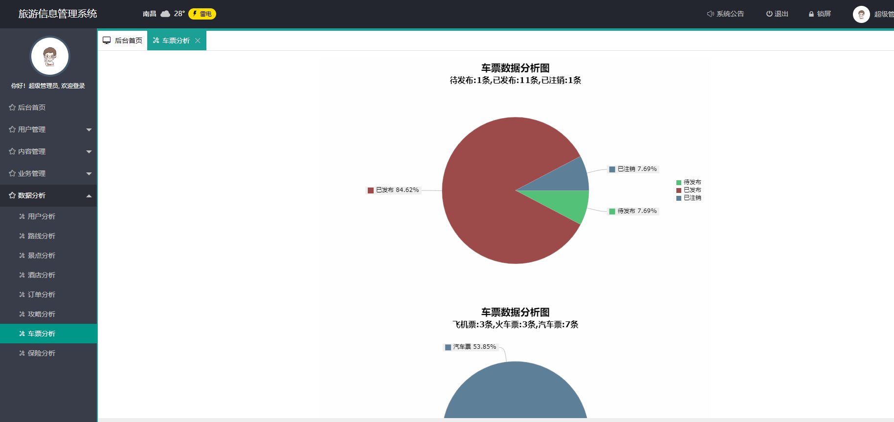

**完整代码收费  加qq  931708230 或者加微信  ynwwxid**

**接毕业设计和论文**

**博客地址：[https://blog.csdn.net/2303_76227485/article/details/128650127](https://blog.csdn.net/2303_76227485/article/details/128650127)**

**视频演示：[https://www.bilibili.com/video/BV1ro4y1A7VS/](https://www.bilibili.com/video/BV1ro4y1A7VS/)**

**毕业设计所有选题地址：[https://github.com/ynwynw/allProject](https://github.com/ynwynw/allProject)**

## 基于springboot的景区旅游信息管理系统(源代码+数据库)

## 一、系统介绍

本项目分为管理员与普通用户两种角色

- 用户登录
  前台功能：旅游路线、旅游景点、旅游酒店、旅游车票、旅游保险、旅游策略
- 管理员登录
  后台功能：用户管理、旅游路线管理、旅游景点管理、旅游酒店管理、
  旅游车票管理、旅游保险管理、旅游策略管理、订单管理管理、留言管理、数据分析等等。

## 二、所用技术

后端技术栈：

- springboot
- mybatis
- mysql

前端技术栈：

- html+layui

## 三、环境介绍

基础环境 :IDEA/eclipse, JDK 1.8, Mysql5.7及以上,Maven

源码+数据库脚本

所有项目以及源代码本人均调试运行无问题 可支持远程调试运行

## 四、页面截图

## 五、浏览地址

前台
地址：http://localhost:8097/index

账号：user  密码：123456

后台
地址：http://localhost:8097/login

账号：root  密码：123456

## 六、安装教程

1. 使用Navicat或者其它工具，在mysql中创建对应名称的数据库，并导入项目的sql文件；
2. 使用IDEA/Eclipse导入项目，若为maven项目请选择maven;
   若为maven项目，导入成功后请执行maven clean;maven install命令，然后运行；
3. 修改application.yml 里面的数据库配置
4. 启动项目后端项目 

**需要完整代码可以加qq  931708230 或者加微信 ynwwxid**

**需要完整代码可以加qq  931708230 或者加微信  ynwwxid**
